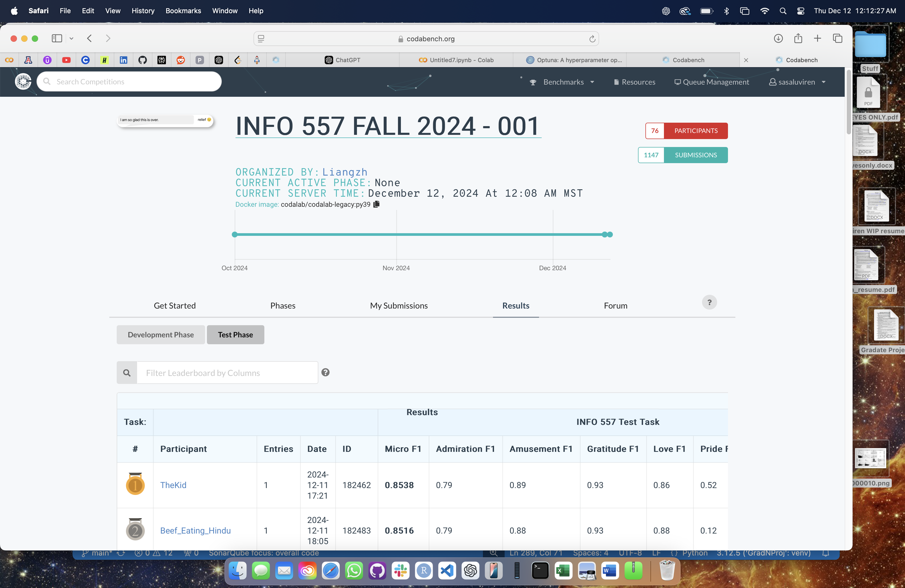

# Emotion Classification with Neural Networks

## Overview
This project focuses on building an emotion classification system using deep learning techniques. The system predicts emotions based on text input, utilizing a combination of transformer-based models and recurrent neural networks.

Key highlights:
1. **Transformer Models**: Use of `distilroberta-base` for feature extraction.
2. **Bi-Directional LSTM**: Captures sequential dependencies in text data.
3. **Custom Metrics and Callbacks**: Incorporation of F1 metrics for performance evaluation.
4. **Grid Search for Hyperparameter Tuning**: Optimized the model for best results.

I participated in a class-wide competition. The competition website is:the Codabench competition  https://www.codabench.org


**Achievement**: This project won the class-wide competition, demonstrating its superior performance and accuracy.




## Features
- Text preprocessing and tokenization with `transformers`.
- Model architecture combining transformers and LSTM.
- Metrics computation: Precision, Recall, F1-Score.
- Exporting predictions for external evaluation.

## Dataset
- **Train Data**: Contains text samples labeled with multiple emotions (`admiration`, `amusement`, `gratitude`, etc.).
- **Dev Data**: Used for validation during training.
- **Test Data**: Final evaluation on unseen data.

## Installation and Setup
### Prerequisites
- Python 3.8 or above
- Required Libraries: `numpy`, `pandas`, `tensorflow`, `transformers`, `scikit-learn`

### Installation
1. Clone the repository:
   ```bash
   git clone <repository_url>
   ```
2. Navigate to the project directory:
   ```bash
   cd emotion_classification
   ```
3. Install dependencies:
   ```bash
   pip install -r requirements.txt
   ```

## Project Structure
```
├── data                # Dataset files (train, dev, test)
├── results              # Saved models and tokenizers
├── best_emotion_classifier8535.h5 # Saved models and tokenizers
├── text_sent.py
├── Predict.py
├── best_model.ipynb - Colab.html      
├── requirements.txt    # List of dependencies
└── README.md           # Project documentation
```

## Usage
### Training the Model
1. Modify the `train.csv` and `dev.csv` paths in the script.
2. Train the model:
   ```bash
   python text_sent.py
   ```
3. The trained model and tokenizer will be saved in the `models/` directory.

### Generating Predictions
1. Modify the `test.csv` path in the script.
2. Run the prediction script:
   ```bash
   python src/predict.py
   ```
3. Predictions will be saved in a CSV and ZIP format.

## Model Architecture
1. Transformer (`distilroberta-base`) for contextual embeddings.
2. Bi-Directional LSTM for sequence modeling.
3. Dense layers with dropout for regularization.

## Evaluation Metrics
- **Per-label Metrics**: Precision, Recall, F1-Score for each emotion.
- **Overall Metrics**: Micro and Macro F1-Scores.

## Results
- **Best Macro F1-Score**: 0.8535 (achieved after grid search).

## Future Work
- Experiment with advanced transformer architectures (e.g., BERT, GPT).
- Incorporate attention mechanisms for better sequence modeling.
- Explore techniques for handling class imbalance.

## Acknowledgments
- Hugging Face Transformers for pre-trained models.
- Scikit-learn for evaluation metrics.
- TensorFlow and Keras for deep learning frameworks.

## License
This project is licensed under the MIT License. See `LICENSE` for details.

